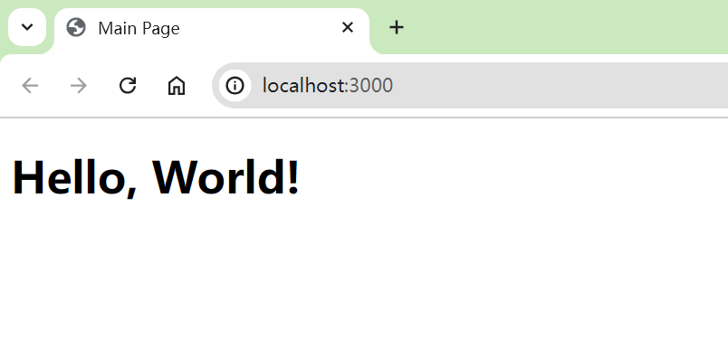

# Minimal-React-TS-Setup

# English

Without using `create-react-app` and without relying on `react-scripts`, create a minimal project that includes `react.js`+`typescript`+`webpack`.

You can copy this project for rapid development, or quickly start it to verify some features.

## Usage

> git clone github.com/knowckx/Minimal-React-TS-Setup.git

> npm install

> npm start

# Chinese

不使用`create-react-app`, 也不依赖`react-scripts`, 创建一个最精简的同时包含 `react.js`+`typescript`+`webpack`这三项技术的启动项目。

可以复制这个项目后进行快速的开发，或者快速启动来验证一些功能点。

## 使用方法

> git clone github.com/knowckx/Minimal-React-TS-Setup.git

> npm install

> npm start

